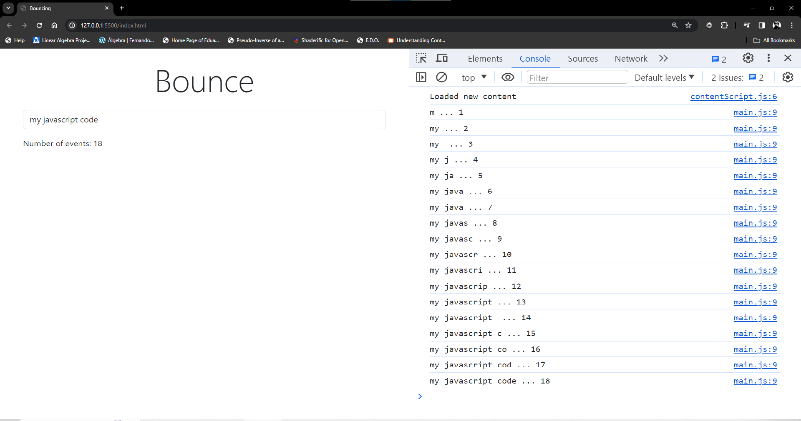

# Debouncing
It is a performance optimization technique.  The idea is to control want how often a function is actually gets executed.  This is often relevant in scenarios like handling user input or responding to events that can fire rapidly.



```javascript
let counter=0;
const countEvent=document.querySelector(".count-events");
const userInput=document.querySelector(".input-entry");

countEvent.innerText=counter;

function inputHandler(event){
    counter++;
    console.log(event.target.value+" ... "+counter);
    countEvent.innerText=counter;
}

userInput.addEventListener("keyup", inputHandler)
```
